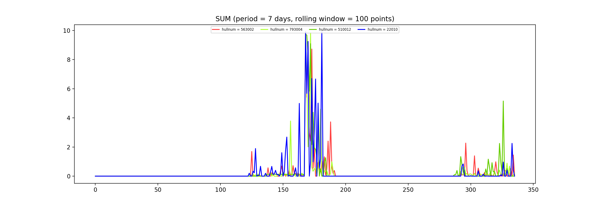
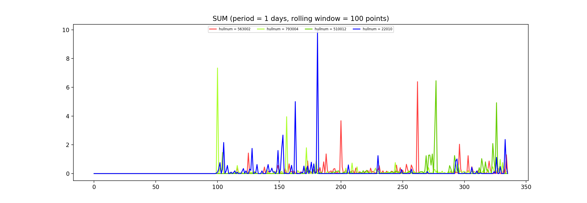

## This project is to detect the anomaly data in the log of China Welfare Lottery

### Data Source
- log of China Welfare Lottery from Elastic Search
- Type: Log

### Algorithm
- Load the log as time series
- data cleaning 
- Add some Aggregation function
- Adjust period
- use Dynamic threshold to detect the anomaly

### Parameters of Configure file

#### ES
- es_address = "10.10.11.64:9202"  
- index = "logstash-management-success-2017-10"
- doc_type = "management"
- timestamp = ["2017-10-01T00:00:00","2017-10-31T00:00:00"]
- valid_dataset = [("status","NO_EXCEPTION"),("operation","BettingCardAddBalance")]
- time_span = "30min"

#### PERIODISM
- period = "day"

#### INFLUENCERS
- influencers = [("hallnum","568004")]

#### DETETERS
- detecters = [("AddBalance","sum"),("AddBalance","count"),("AddBalance","mean"),("AddBalance","ratio")]

### screenshots of project

